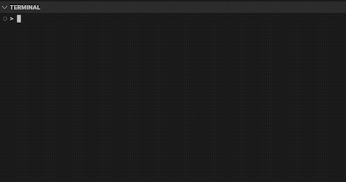

# express-deployer

The express-deployer **boilerplate** is a solidity development framework using truffle and ganache for fast testing of solidity smart contracts on live EVM networks using instantanious virtual forks.

* Truffle migrations and tests written in **Typescript**
* Concurrently start a single-use ganache instance and execute truffle commands 
* Testing with instant virtual forks of EVM networks


# Get started

## Prerequisites

* python
* Node.js version `16.xx`
* npm version `6.xx`

## Quick start

```console
npm install
npm run transpile-migrations
npm run test
```

## Usage
Run commands with npm scripts

* `compile`: truffle compile + generate-types
* `generate-types`: generate .d.ts files for migrations and tests
* `migrate`: transpile-migrations + truffle migrate
* `transpile-migrations`: generate .js files for ./migrations-ts/*.ts
* `ganache`: run ganache in fast and quiet mode
* `ganache:fork`: run ganache fork using the RPC defined in .npmrc
* `test`: ganache + truffle test
* `test:fork`: ganache:fork + truffle test

Due to truffle not supporting .ts migrations we have to transpile them before running `migrate` or `test`. Contracts need to have a deployment described under `migrations` in order to be tested.



## Installation caveats

* Manipulate node versions with `nvm`.
    * `nvm version` to see current node version
    * `nvm  use {verison}` to switch versions
* install error due to sqlite3 is usually caused by npm not finding python
    * use npm with the `--python` flag or `npm config set python`

```
npm install --python=/usr/bin/python3
npm config set python=/usr/bin/python3
```

# License
Nope